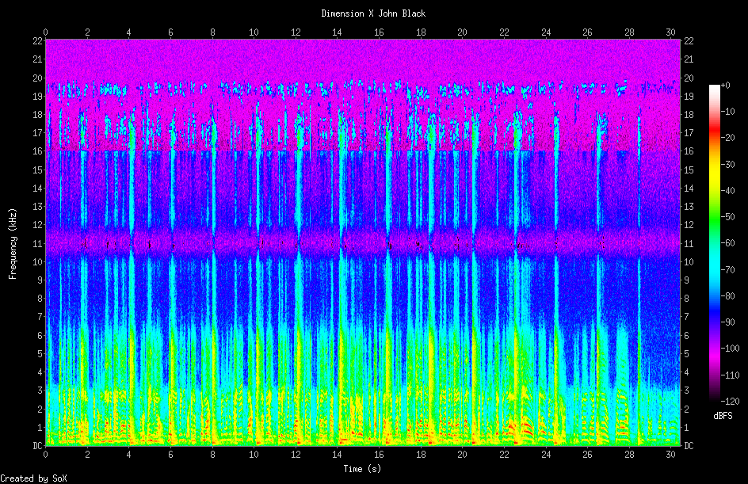

# Activities
All of the activities below are designed to be done with the [radio drama scenario](https://github.com/seanluyk/audio101/blob/master/exercises_intro.md#scenario) described, but are easily adaptable to your own projects:
## 1.0 Basic Audio Editing Using Audacity
### 1.1 Watch an introductory tutorial (optional)
- [Audacity: Complete Tutorial Guide to Audacity for Beginners / David Taylor](https://www.youtube.com/watch?v=aCisC3sHneM)
### 1.2 Clean up and segment your recordings
- Locate the program introductions (advertisements, program introduction, sound effects, music, etc.) and copy them to new tracks (1 for each program). Add descriptive labels
- Remove the program closing (advertisements, credits, sound effects, music, etc.) and copy to them a new tracks (1 for each program). Add descriptive labels
- At this point you should have 6 tracks:
  - Dimension X Introduction
  - X Minus One Introduction
  - Dimension X Closing
  - X Minus One Closing
  - Dimension X Story
  - X Minus One Story
- Remove unnecessary silence at the beginning and end of each of your tracks track (hint: zoom is your best friend!), but keep some as to avoid awkward clicks
- Introduce fades at the beginning and end of each track as needed, using the fade in/fade out effects. * Use Brandon Walsh's excellent instructions for how to do this in [Editing Audio with Audacity](https://programminghistorian.org/en/lessons/editing-audio-with-audacity#editing-audio)  
### 1.3 Make clips of the closing line by Captain John Black (quoted below) from each audio recording for the purposes of analysis and comparison: 
> > Listen! Listen! They're trying to break through the hall. Edward and Mom and Dad and all the folks, but they're changing now. They're melting and changing back into... they're Martians! Can you understand? They're Martians, not men! They made us think that Mars was heaven, and we fell into the trap. Can you hear me earth? You've got to stop the next rocket! Listen, tell my brother Will, tell my brother not to come, they'll trap him too. They'll kill them all! Hello! Hello! Can you hear me earth? This is John Black on Mars. Hello Earth! This is John Black on Mars! Hello Earth! Hello Earth! Hello Earth!
- Locate the boundaries of this line in each of your Story tracks
- Copy them to new tracks, and add descriptive labels
- At this point you should have 8 tracks
### 1.4 Listen to each of the closing clips closely and note:
1. Their loudest and softest points (amplitude); highest and lowest points (frequency). How does this correspond to the text? How are their performances the same? How are they different? 
2. Any interesting sonic features? 
3. Repeat this for one of your pairs of clips (optional) 
## 2. Compare Two Recordings Using Sonic Lineup
- Export the Captain John Black closing line clips
  - Mute all but your desired clips for export
  - File>Export Multiple
- Open them up in Sonic Lineup
- Explore the various visualization options available
- Use the speed up/slow down features and toggle between recordings to do some close listening
- For more help using Sonic Lineup, refer to [Sonic Lineup: A Brief Reference](https://sonicvisualiser.org/sonic-lineup/doc/reference/1.0/en/index.html)
## 3.0 Use the Command Line (SoX) to Manipulate Audio Files
 - If you haven't already done so or need help, [install SoX](https://github.com/seanluyk/audio101/blob/master/SoX_installation.md)
 - For the activities below, use your Captain John Black files created in activity 1.3, or other files you brought with you 
### 3.1 Get metadata about an audio file
- Open **Terminal**
- **Navigate** to your Audio 101 files using the command line
- In **Terminal** type:
~~~shell
sox filename.wav -n stat
~~~
- This provides you with some very basic stats which may be useful/interesting to you
- You can also use the soxi command to get information from the file header. In **Terminal** type:
~~~shell
soxi filename.wav
~~~
 - This returns information found in the file's header
 - You can also type multiple file names after the main sox/soxi commands to get stats returned for multiple files at once for the purposes of comparison:
 ~~~shell
 soxi filename1.wav filename2.wav
 sox filename1.wav filename2.wav -n stat
 ~~~
 - How are your results different when using stat vs. soxi?
### 3.2 Combine multiple audio files
- In SoX there are multiple methods for combining audio files, which we'll experiment with below:
#### Concatenate files
- In **Terminal** type:
~~~shell
sox --combine concatenate inputfile1 inputfile2 outputfile.wav
~~~
- Hear the result by typing:
~~~shell
play outputfile.wav
~~~
- You can stop playback by typing CTRL+C
- You can even play files back in reverse! Type:
~~~shell
play outputfile.wav reverse
~~~
#### Merge Files
- In **Terminal** type:
~~~shell
sox -m filename1.wav filename2.wav outputfile.wav
~~~ 
- This will create one file that mixes the other files together
- Using the remix command, you can also mix individual channels from multiple files together very easily, although we won't work on this today
### 3.3 Modify files
- SoX had many commands that allow you to easily modify files in the command line. Today we'll work with some basic ones:
#### Pad a recording with silence
- In **Terminal** type:
~~~shell
sox filename1.wav outputfile.wav \
pad [amount of silence in HH:MM:SS to add at the beginning of your file] [amount of silence in HH:MM:SS to add at the end of your file]  
~~~ 
#### Apply a fade in/fade out
- Similar to the pad command, the fade command can be used to add fade-ins/outs to a file:
- In **Terminal** type:
~~~shell
sox filename1.wav filename2.wav outputfile.wav \
fade [fade in position in HH:MM:SS] [fade out start in HH:MM:SS]
~~~ 
### 3.4 Visualize your audio files
#### Create a spectrogram!
- In **Terminal** type:
~~~shell
sox filename1.wav -n spectrogram -h -t 'title text' -o [filename.png]
~~~ 
-This will create a high contrast (-h) spectrogram of the entire audio file with the filename (-o) and a descriptive title (-t):

- There are many more options for the spectrogram effect described in the [SoX documentation](http://sox.sourceforge.net/sox.html#EFFECTS) for you to explore!
